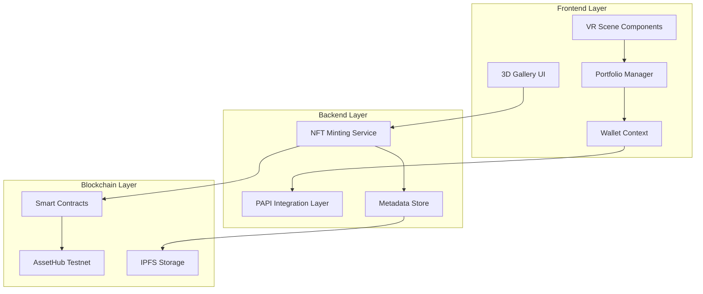

# Design Document

## Overview

The NFT Portfolio Integration feature transforms Polka-Space into a comprehensive Web3 platform by connecting the existing VR/WebXR frontend with a robust blockchain backend. The system enables seamless minting of 3D artwork as NFTs, portfolio management, and social discovery within the Polkadot ecosystem.

The architecture follows a three-tier approach: a React-Three-Fiber frontend with enhanced portfolio components, a Node.js backend service for blockchain abstraction, and smart contracts deployed on AssetHub testnet for NFT operations.

## Architecture

### System Components



### Data Flow Architecture

1. **Minting Flow**: User selects 3D model → Frontend captures metadata → Backend processes mint request → Smart contract creates NFT → Confirmation updates UI
2. **Portfolio Flow**: User requests portfolio → Backend queries blockchain → Frontend renders NFT collection with 3D assets
3. **Social Flow**: User browses community → Backend aggregates public NFTs → Frontend displays interactive gallery

## Components and Interfaces

### Frontend Components

#### Portfolio Manager (`src/components/portfolio/`)
- **PortfolioView.tsx**: Main portfolio interface displaying user NFTs
- **MintingModal.tsx**: Modal component for initiating NFT minting
- **CommunityGallery.tsx**: Social discovery interface for browsing public NFTs
- **NFTCard.tsx**: Individual NFT display component with 3D preview

#### Enhanced VR Components (`src/components/vr/`)
- **NFTGallery.tsx**: Extended to support minted NFT display
- **MintButton.tsx**: In-scene minting interface integration
- **OwnershipIndicator.tsx**: Visual indicators for NFT ownership status

### Backend Services

#### NFT Minting Service (`backend/src/services/`)
- **mintingController.ts**: API endpoints for minting operations
- **metadataProcessor.ts**: 3D model metadata extraction and validation
- **transactionManager.ts**: Blockchain transaction handling and status tracking

#### PAPI Integration Layer (`backend/src/papi/`)
- **papiClient.ts**: Core PAPI client configuration and connection management
- **walletAdapter.ts**: Wallet connection and authentication through PAPI
- **chainQueries.ts**: Blockchain state queries and NFT ownership lookups

### Smart Contract Layer

#### AssetHub NFT Contract (`contracts/substrate/nft-portfolio/`)
- **lib.rs**: Main contract implementing NFT minting with 3D metadata
- **metadata.rs**: 3D-specific metadata structures and validation
- **ownership.rs**: NFT ownership and transfer logic

## Data Models

### NFT Metadata Structure
```typescript
interface NFTMetadata {
  id: string;
  name: string;
  description: string;
  model: {
    url: string;
    format: 'glb' | 'gltf';
    size: number;
    dimensions: {
      width: number;
      height: number;
      depth: number;
    };
  };
  materials: MaterialProperty[];
  creator: string;
  timestamp: number;
  attributes: Record<string, any>;
}

interface MaterialProperty {
  name: string;
  type: 'PBR' | 'Standard' | 'Custom';
  properties: Record<string, any>;
}
```

### Portfolio Data Structure
```typescript
interface UserPortfolio {
  walletAddress: string;
  nfts: NFTMetadata[];
  totalValue: number;
  createdCount: number;
  lastUpdated: number;
}

interface CommunityFeed {
  recentMints: NFTMetadata[];
  featuredCreators: string[];
  totalNFTs: number;
}
```

### Transaction State Management
```typescript
interface MintTransaction {
  id: string;
  status: 'pending' | 'processing' | 'completed' | 'failed';
  metadata: NFTMetadata;
  walletAddress: string;
  transactionHash?: string;
  blockNumber?: number;
  error?: string;
  createdAt: number;
  updatedAt: number;
}
```

## Error Handling

### Frontend Error Management
- **Connection Errors**: Graceful wallet disconnection handling with reconnection prompts
- **Minting Failures**: User-friendly error messages with retry mechanisms
- **Loading States**: Progressive loading indicators for blockchain operations
- **Validation Errors**: Real-time form validation for metadata inputs

### Backend Error Handling
- **Blockchain Connectivity**: Automatic retry logic for network interruptions
- **Transaction Failures**: Detailed error logging and user notification system
- **Metadata Validation**: Comprehensive validation with specific error messages
- **Rate Limiting**: Protection against spam minting attempts

### Smart Contract Error Handling
- **Insufficient Funds**: Clear error messages for transaction fee requirements
- **Invalid Metadata**: Validation errors for malformed 3D model data
- **Ownership Conflicts**: Prevention of duplicate minting attempts
- **Network Congestion**: Graceful handling of network delays

## Testing Strategy

### Unit Testing
- **Frontend Components**: React Testing Library for portfolio and minting components
- **Backend Services**: Jest tests for API endpoints and blockchain integration
- **Smart Contracts**: ink! test framework for contract logic validation

### Integration Testing
- **End-to-End Minting**: Complete workflow testing from UI to blockchain
- **Portfolio Synchronization**: Testing blockchain state reflection in frontend
- **Cross-Component Communication**: Validation of data flow between layers

### Performance Testing
- **3D Rendering**: Performance benchmarks for NFT gallery rendering
- **Blockchain Queries**: Response time optimization for portfolio loading
- **Concurrent Users**: Load testing for multiple simultaneous minting operations

### Testnet Validation
- **AssetHub Integration**: Live testing on AssetHub testnet environment
- **Wallet Compatibility**: Testing with multiple Polkadot wallet providers
- **Transaction Verification**: On-chain verification of minted NFTs and metadata

## Security Considerations

### Frontend Security
- **Wallet Integration**: Secure handling of wallet connections and signatures
- **Input Validation**: Client-side validation for all user inputs
- **XSS Prevention**: Sanitization of user-generated content and metadata

### Backend Security
- **API Authentication**: Rate limiting and request validation
- **Metadata Sanitization**: Validation and cleaning of 3D model metadata
- **Transaction Security**: Secure handling of blockchain transactions and private keys

### Smart Contract Security
- **Access Control**: Proper ownership validation and transfer restrictions
- **Reentrancy Protection**: Prevention of malicious contract interactions
- **Metadata Integrity**: Validation of 3D model metadata before minting

## Performance Optimization

### Frontend Optimization
- **3D Model Caching**: Efficient caching of frequently accessed models
- **Lazy Loading**: Progressive loading of NFT collections
- **Virtual Scrolling**: Optimized rendering for large portfolio collections

### Backend Optimization
- **Database Indexing**: Optimized queries for NFT ownership and metadata
- **Caching Layer**: Redis caching for frequently accessed blockchain data
- **Connection Pooling**: Efficient management of blockchain connections

### Blockchain Optimization
- **Batch Operations**: Grouping multiple operations to reduce transaction costs
- **Metadata Compression**: Efficient encoding of 3D model metadata
- **Query Optimization**: Minimizing blockchain queries through smart caching